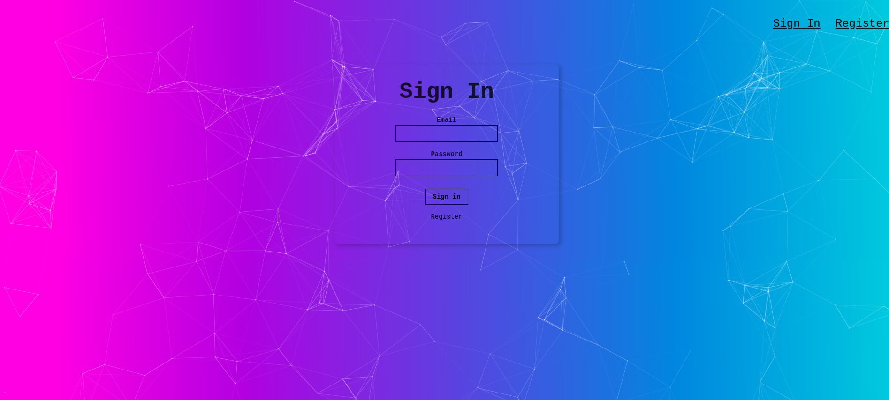

# Face Recognition App
This is the project I am most proud of. The front-end was created with React. The backend server was done with Node.js and tested using Postman. It also includes a database made with PostgreSQL. The backend server was committed to another github file  and the app was published on Heroku 

Give it a try by registering any random name, email, and password. Once given access, post a URL of an image in the form and click “Detect.”  The app will detect the face in the image.

## Starting the dev server
Make sure you have the latest stable or LTS version of `node.js` installed.

1. `git clone https://github.com/Code4Blessings/face_recognition_app.git`
2. Run `npm install` or `yarn install`
3. Start the dev server using `npm start`
4. Open [http://localhost:3000](http://localhost:3000)

#